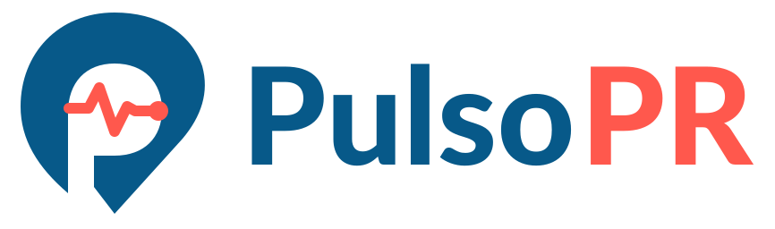
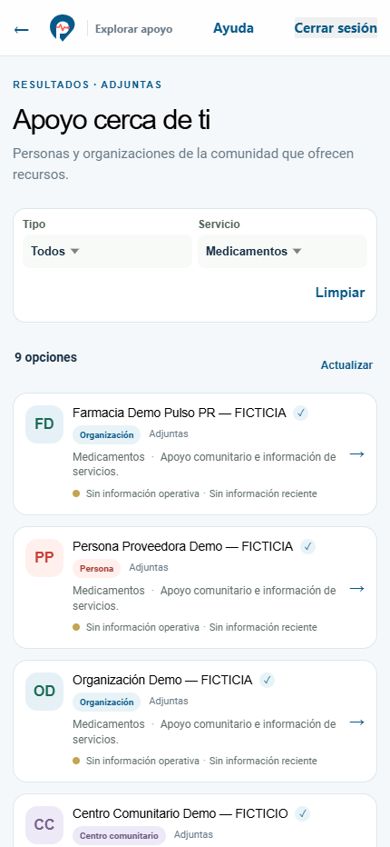
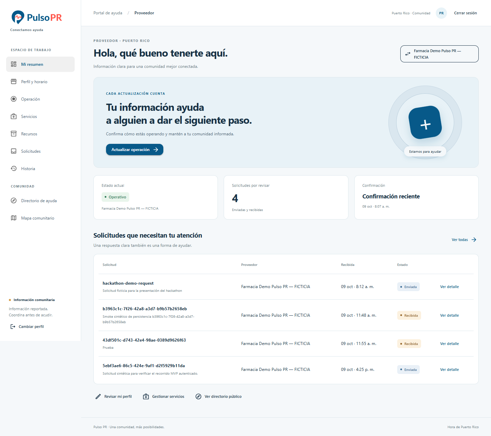

# Pulso PR

<p align="center">
  
</p>

<p align="center">
  
</p>

Pulso PR es un MVP para conectar a personas que necesitan ayuda no urgente con farmacias y proveedores comunitarios de Puerto Rico. La app ciudadana permite consultar servicios y disponibilidad sintética, enviar solicitudes y ver respuestas. El portal permite a proveedores responder y a administración revisar la actividad.

Desarrollado por el **team de KPG.Inc** para el hackathon del **Caribbean AI Summit 2026**, en San Juan, Puerto Rico. [Información del hackathon](https://www.caribbeansummit.ai/es/hackathon) · [Caribbean AI Summit](https://www.caribbeansummit.ai/es) · [Proyecto en Devpost](https://devpost.com/software/pulsopr) (la presentación aún no está publicada).

> Este repositorio contiene el MVP de hackathon. La disponibilidad, los proveedores y las incidencias de demostración son sintéticos. No uses el sistema con datos personales ni para coordinar una emergencia.

## Run Existing Hackathon Demo

| Cliente | Demo alojada |
|---|---|
| App ciudadana | [Pulso PR · Apoyo cerca de ti](https://pulso-pr-app.appwrite.network/) |
| Portal de proveedores y administración | [Pulso PR Web](https://pulso-pr-web.appwrite.network/) |

La demo alojada usa el proyecto Appwrite compartido del hackathon. Estos accesos son cuentas ficticias publicadas para la demostración; no reutilices sus contraseñas.

| Rol | Correo | Contraseña |
|---|---|---|
| Ciudadanía | `ciudadano@pulso-pr.test` | `CiudadanoPR-Demo26!` |
| Proveedor | `proveedor@pulso-pr.test` | `ProveedorPR-Demo26!` |
| Administración | `administracion@pulso-pr.test` | `AdminPR-Demo26!` |

### Recorrido del MVP

- **Ciudadanía:** buscar por municipio y tipo de proveedor, consultar el mapa y los datos sintéticos del centro, enviar una solicitud no urgente y revisar la respuesta.
- **Proveedor:** iniciar sesión, revisar solicitudes y actualizar información operativa, servicios, recursos y respuestas.
- **Administración:** consultar centros, solicitudes y un panorama básico de actividad.

Las cuentas y la membresía de Team organizan las vistas. Las colecciones y el bucket del demo tienen permisos abiertos para datos sintéticos; los roles del cliente no son un límite de seguridad de servidor. No es un sistema de producción ni una fuente oficial de disponibilidad o alertas.

### Vista previa

<p>
  
  
</p>

## Install From Scratch With Your Own Appwrite Project

Crea un proyecto Appwrite Cloud nuevo para desarrollo. La instalación desde cero conserva la misma base, colecciones, atributos, índices, permisos, bucket y datos sintéticos del MVP. Sigue la [guía completa de instalación](docs/backend/SETUP-FROM-SCRATCH.md) antes de ejecutar provisioning; incluye región y endpoint, API key temporal, configuración de ambas apps, pruebas y pasos manuales de Console.

Requisitos: Node.js 24, npm y .NET 10 SDK. Los scripts de provisioning son dry-run por defecto y requieren un Project ID explícito de desarrollo; el proyecto compartido del hackathon está bloqueado. Nunca uses una API key en el navegador, los archivos de cliente ni Git.

Desde la raíz, inspecciona el plan offline y verifica los contratos:

```powershell
node backend/setup/provision-fresh-project.mjs --target-environment development --target-project-id <PROJECT_ID> --endpoint https://<REGION>.cloud.appwrite.io/v1
npm --prefix backend test
npm --prefix backend run setup:verify
```

La guía explica cuándo ejecutar `--apply`, cómo generar la configuración local para Ionic y Blazor, y cómo correr el smoke ciudadano → proveedor → administración. Crear el proyecto, habilitar Email/Password, registrar orígenes, aceptar invitaciones y revocar la key son pasos manuales.

**Límite de verificación:** el proceso se ha validado con pruebas offline y fixtures simulados; no se ha instalado en un proyecto Appwrite independiente. No se afirma que la instalación Cloud desde cero esté verificada.

## Ejecutar los clientes

Para la configuración local del proyecto compartido, la configuración versionada usa IDs públicos de la demo. Para otro proyecto, genera los archivos locales según la guía anterior; el configurador se niega a sobrescribirlos salvo que se lo indiques expresamente.

App Ionic React:

```powershell
Set-Location app
npm ci
npm run dev -- --host 127.0.0.1 --port 5173 --strictPort
```

Portal Blazor WebAssembly:

```powershell
Set-Location web
npm ci --ignore-scripts
npm run build:sdk
dotnet restore --locked-mode
dotnet run --no-launch-profile --urls http://localhost:5180
```

Validaciones offline disponibles:

```powershell
Set-Location app
npm run test:domain
npm run build
Set-Location ..\web
npm run test:api
dotnet build --no-restore
Set-Location ..
npm --prefix backend test
npm --prefix backend run setup:verify
```

## Tecnología

- **App ciudadana:** Ionic React, TypeScript, Vite, Capacitor y Appwrite Web SDK.
- **Portal:** Blazor WebAssembly, .NET 10, MudBlazor y Appwrite Web SDK.
- **Datos:** Appwrite Cloud Databases y Storage. El MVP mantiene la API Databases existente para no cambiar el comportamiento de los clientes.

Consulta [el alcance y las limitaciones del MVP](docs/MVP-SCOPE.md) y [la instalación Appwrite](docs/backend/SETUP-FROM-SCRATCH.md).

## Licencia y atribución

El software de este proyecto se distribuye bajo **GNU AGPL v3.0**. Consulta [`LICENSE`](LICENSE). Las dependencias, datos de referencia y assets de terceros conservan sus licencias y atribuciones correspondientes.
